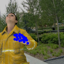

# HandJointRecognitionPytorch

This is a Pytorch version to recognize the hand joints in images. The model and framework are based on [Hand-Joint-Recognition](https://github.com/Skydes/Hand-Joint-Recognition).

### Environment

- Ubuntu 16.04
- Pytorch > 1.10
- Python 3.6

### Data

Please download the RHD data from [here](https://lmb.informatik.uni-freiburg.de/resources/datasets/RenderedHandposeDataset.en.html) and put the folder `RHD_published_v2` under `dataset` folder.

### Train

You can adjust the training settings and hyperparameters in `option.py`.

```python
python train.py [--gpu]
```

### Test

Comment `train(opt)` in line:161 of `train.py` and comment out `test(opt)` in line:162 of `train.py`.

### Visualization




